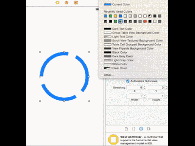

MGFinderView
===============

`MGFinderView` is an animated finder view useful for instance to focus or to suggest a point of the screen to the user.




## Info

This code must be used under ARC. 
If your code doesn't use ARC you can [mark this source with the compiler flag](http://www.codeography.com/2011/10/10/making-arc-and-non-arc-play-nice.html) `-fobjc-arc` 

## Example Usage

As in the video, `MGFinderView` supports `IBInspectable` and `IB_DESIGNABLE` making possible creating and customizing itself from Interface Builder. 

If you instead prefer to create it by code:

```objc
MGFinderView *finderView = [[MGFinderView alloc] initWithSquareSide:150 color:[UIColor greenColor]];
[self.view addSubview:finderView];
[finderView startAnimating];
```

Do you want to do less? Use:

```objc
+ (instancetype)showAnimatedFinderViewForTargetView:(UIView *)targetView;
+ (instancetype)showAnimatedFinderViewForTargetView:(UIView *)targetView color:(UIColor *)color;
```

size and position will be automatically calculated respecting the `targetView`.

## Tips

If you want the view behind the `finderView` still intercetting the user touch, remember to disable the user interaction on the `finderView`:

`finderView.userInteractionEnabled = NO;`

## Contact

Matteo Gobbi

- http://www.matteogobbi.it
- http://github.com/matteogobbi
- http://twitter.com/matteo_gobbi
- https://angel.co/matteo-gobbi
- http://www.linkedin.com/profile/view?id=24211474

## License

`MGFinderView` is available under the MIT license.
